# Employee Management System (EMS)

> 🎓 This project was developed as a **bachelor's thesis** at Batumi Shota Rustaveli State University, Faculty of Exact Sciences and Education, Computer Science program (2026).

**Live demo:** [https://ems.com.ge](https://ems.com.ge)

---

## What is this?

EMS is a full-stack web application for managing employees inside an organization. It covers everything from user roles and department structure to leave requests, attendance tracking, task assignments, and audit logs - all in one place.

The main idea was to build something that actually works as a complete system, not just a bunch of separate tools that don't talk to each other.

---

## Screenshots

### Login


### Admin - Dashboard
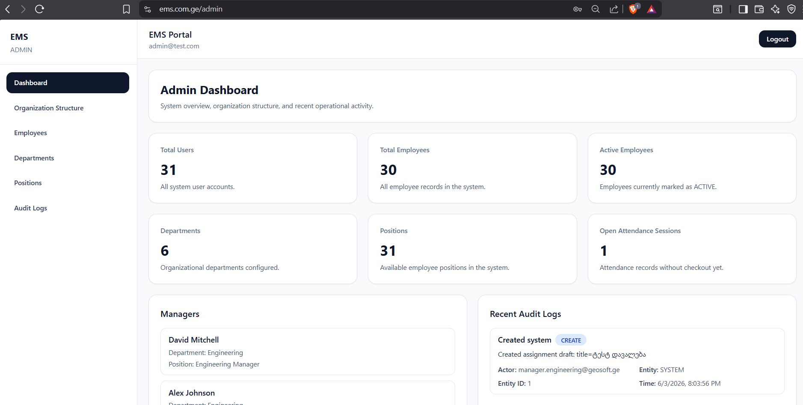

### Admin - Organization Structure
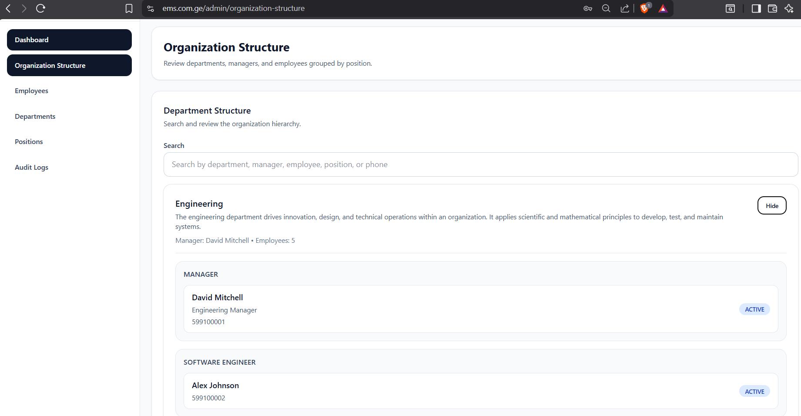

### Admin - Add Employee
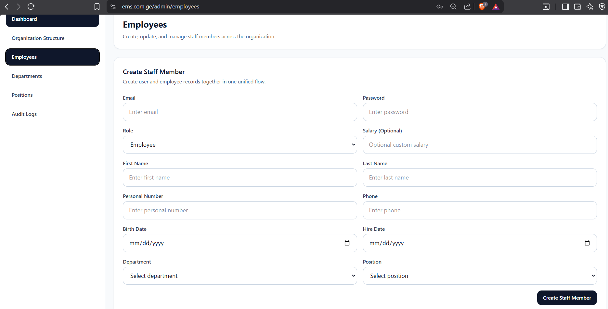

### Admin - Search & Filter Employees
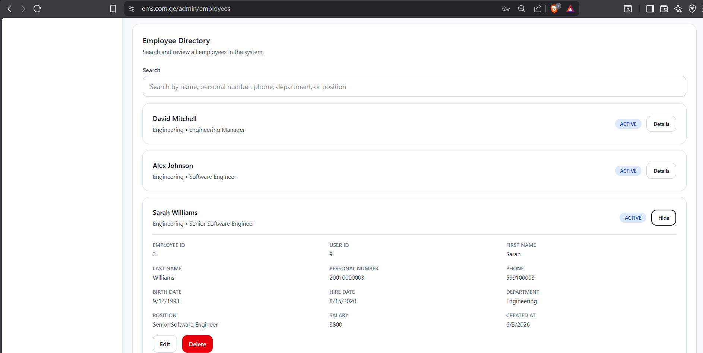

### Admin - Department CRUD
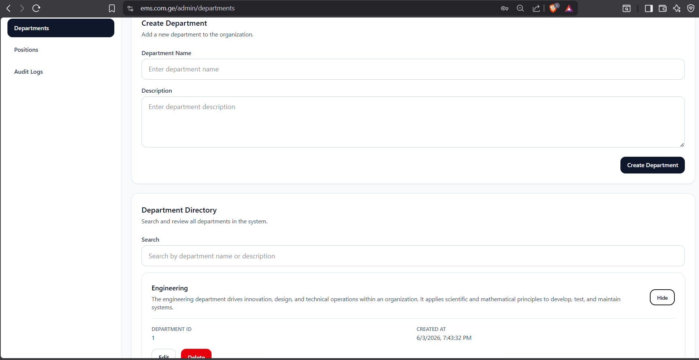

### Admin - Audit Logs
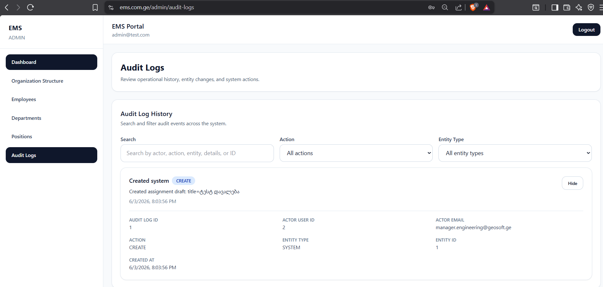

### Manager - Dashboard
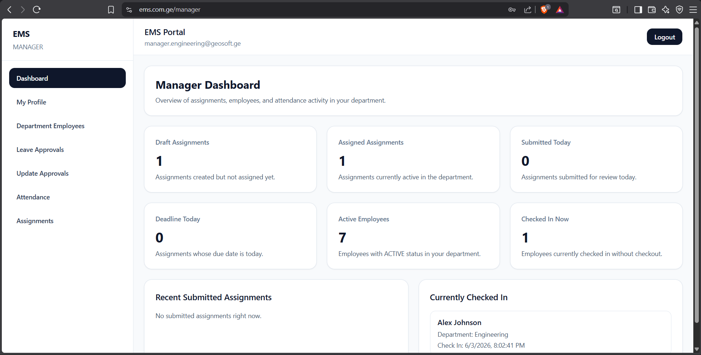

### Manager - Department Employees
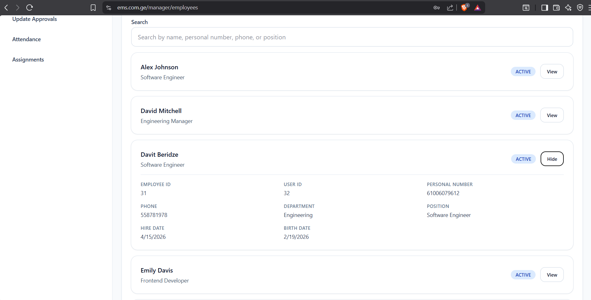

### Manager - Manage Leave Requests
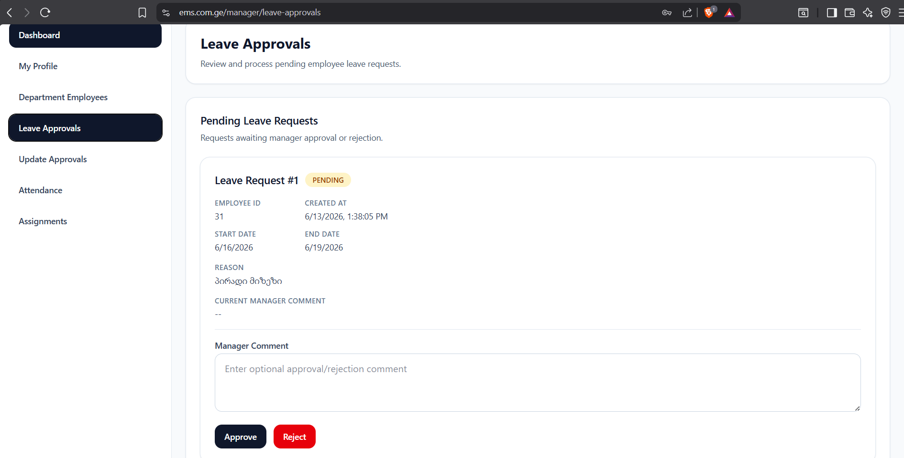

### Manager - Assignments
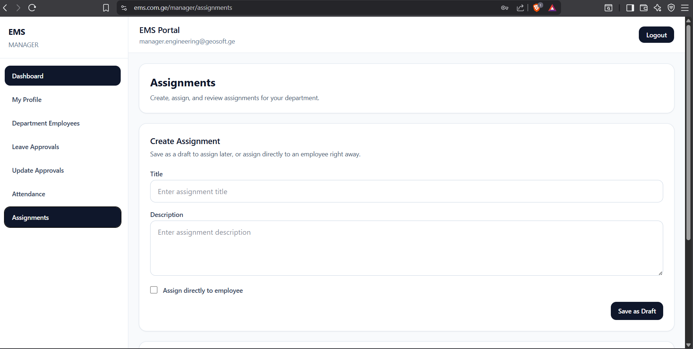

### Manager - Attendance
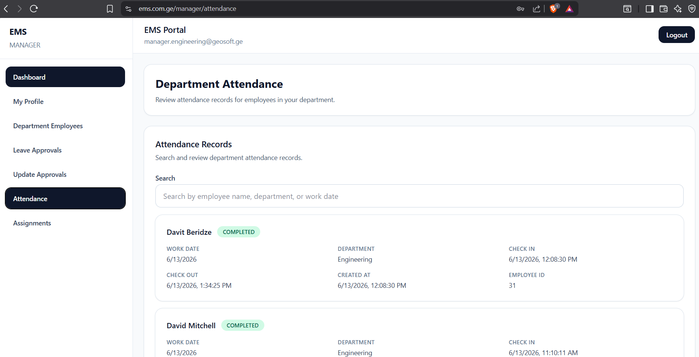

### Employee - Dashboard
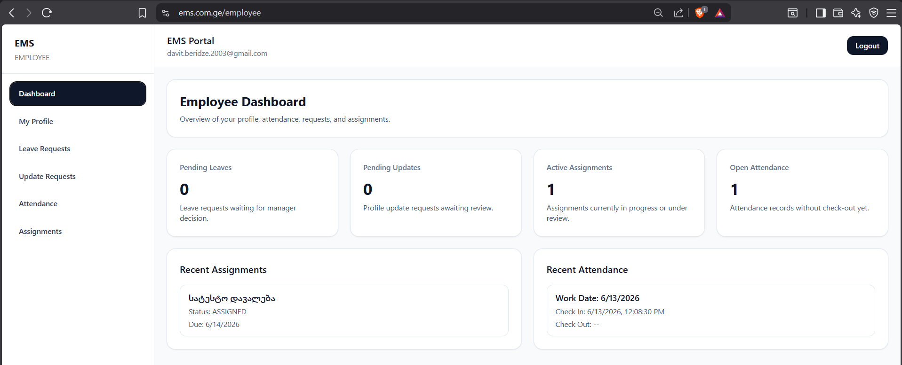

### Employee - Leave Requests
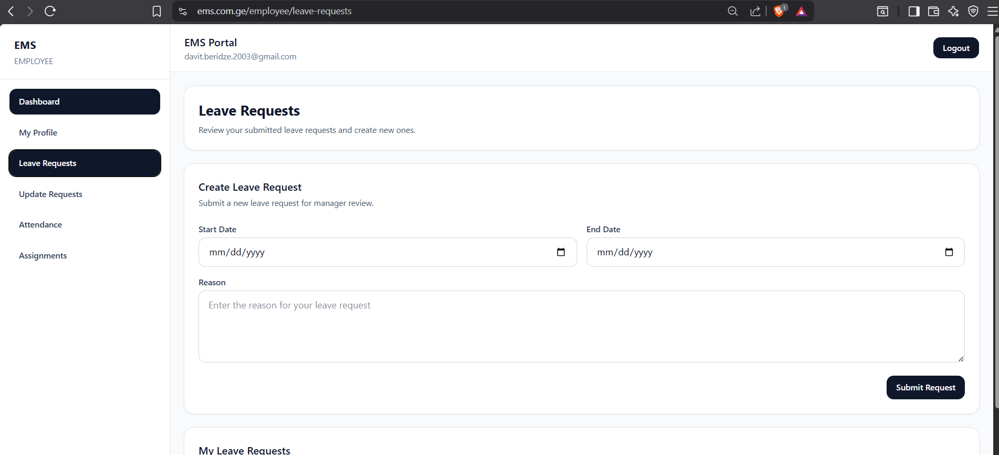

### Employee - Update Request
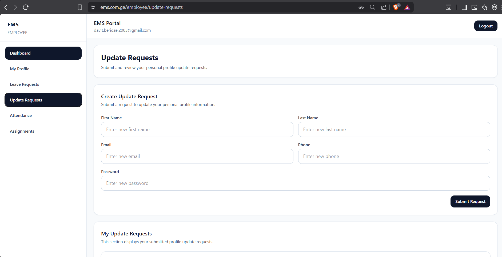

### Employee - Attendance
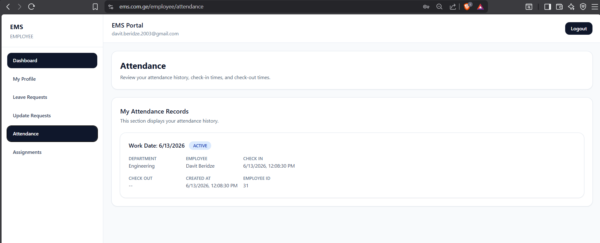

### Employee - Assignments
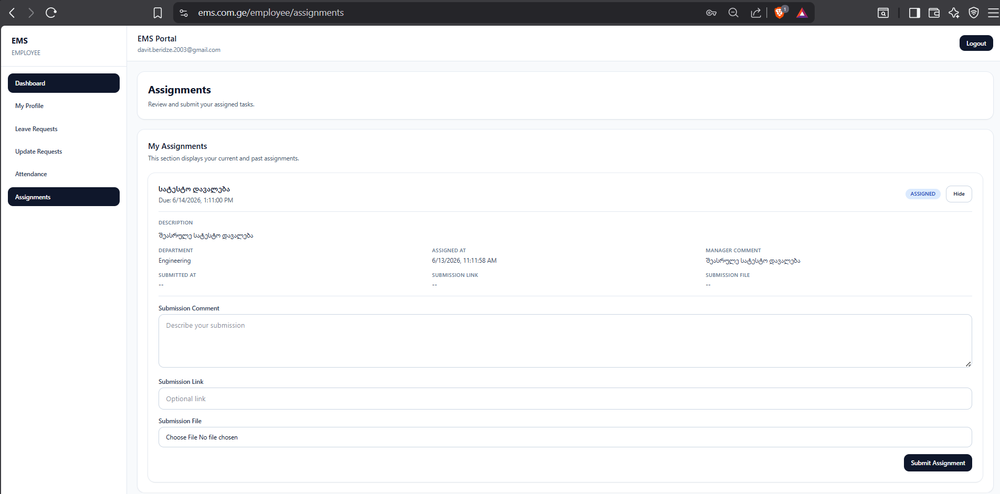

---

## Features

**Admin panel**
- Manage departments, positions, and employees (full CRUD)
- Search employees by ID, personal number, name, department, or status
- View full organization structure with department details
- Complete audit log with action and entity type filters

**Manager panel**
- Approve or reject leave requests with optional comment
- Approve or reject employee profile update requests
- View department attendance records
- Create assignment drafts or assign directly to an employee with deadline and comment
- Review submitted assignments and approve or reject them

**Employee panel**
- View personal profile (name, position, department, salary, status)
- Submit leave requests with type, date range, and reason
- Submit profile update requests (name, email, phone)
- Track attendance - auto check-in on login, auto check-out on logout
- Submit assigned tasks with comments, links, or file uploads

**Automated background tasks**
- Leave status sync - automatically sets employee status to `ON_LEAVE` when leave starts, back to `ACTIVE` when it ends
- Overdue task detection - marks assignments as `OVERDUE` when deadline passes

**Email notifications**
- Leave request approved / rejected
- Profile update approved / rejected
- New task assigned to employee

---

## Tech stack

**Backend**
- Java 21 + Spring Boot 4
- Spring Security + JWT (stateless auth)
- Spring Data JPA + Hibernate
- PostgreSQL
- Flyway (database migrations)
- BCrypt (password hashing)
- Jakarta Validation

**Frontend**
- React 19
- React Router 7
- Tailwind CSS
- Axios
- Vite

**Infrastructure**
- Contabo VPS (Ubuntu 24.04)
- Nginx (reverse proxy + static files)
- Cloudflare (DNS + SSL/TLS)
- Let's Encrypt (HTTPS certificate)
- systemd (auto-start on server reboot)

---

## Project structure

```
employee-management-system/
├── EMS - back-end/        # Spring Boot REST API
│   └── src/main/java/ge/edu/bsu/ems/
│       ├── assignment/
│       ├── attendance/
│       ├── audit/
│       ├── config/
│       ├── department/
│       ├── employee/
│       ├── leave_request/
│       ├── position/
│       └── user/
├── EMS - front-end/       # React SPA
│   └── src/
│       ├── features/
│       ├── pages/
│       │   ├── admin/
│       │   ├── manager/
│       │   └── employee/
│       └── shared/
└── screenshots/
```

---

## Running locally

**Backend**

```bash
cd "EMS - back-end"
# Create src/main/resources/application.properties with your DB and mail config
./mvnw spring-boot:run
```

**Frontend**

```bash
cd "EMS - front-end"
# Create .env with: VITE_API_BASE_URL=http://localhost:8080/api
npm install
npm run dev
```

You'll need PostgreSQL running locally with a database called `ems`.

---

## Security notes

- Passwords hashed with BCrypt
- JWT tokens for stateless session management
- Role-based access control: `ADMIN`, `MANAGER`, `EMPLOYEE`
- CORS configured for production domain only
- `application.properties` is excluded from version control

---

## Author

**Davit Beridze**  
Bachelor's thesis - Computer Science  
Batumi Shota Rustaveli State University, 2026  
Supervisor: Assistant Professor Besik Beridze

GitHub: [@TheDavitBeridze](https://github.com/TheDavitBeridze)
